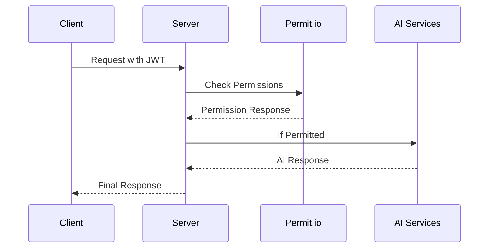

# Donna.ai Server 🍩

The backend server for Donna.ai, an intelligent AI agent for Donut Naturales that combines multiple AI capabilities with Permit.io's role-based access control.

## 🚀 Quick Start

### Prerequisites

- Python 3.11 or higher
- A Permit.io account
- OpenAI API key
- Pinecone account
- GitHub account with API access

### Environment Setup

1. Clone the repository:
```bash
git clone https://github.com/yourusername/permit-hack-backend.git
cd permit-hack-backend
```

2. Create a virtual environment:
```bash
python -m venv venv
source venv/bin/activate  # On Windows: venv\Scripts\activate
```

3. Install dependencies:
```bash
pip install -r requirements.txt
```

4. Set up your environment variables in `.env`:
```env
# OpenAI Configuration
OPENAI_API_KEY=your_openai_api_key

# Pinecone Configuration
PINECONE_API_KEY=your_pinecone_api_key

# GitHub Configuration
GITHUB_API_KEY=your_github_token
GITHUB_API_REPO_URL=https://api.github.com/repos/username/repo
GITHUB_REPO_URL=https://github.com/username/repo

# Permit.io Configuration
PERMIT_API_KEY=your_permit_api_key
PERMIT_PROJECT_ID=your_project_id
PERMIT_ENVIRONMENT_ID=your_environment_id
PERMIT_PDP_URL=https://cloudpdp.api.permit.io
```

### Permit.io Setup

1. Create a Permit.io account at [permit.io](https://permit.io)
2. Create a new project
3. Set up the following roles:
   - Developer
   - Product Manager
   - QA
   - Admin
4. Configure permissions for each role:
```python
PERMISSION_TYPES = {
    "onboarding_query": {"action": "read", "resource": "onboarding"},
    "github_issues": {"action": "create", "resource": "issues"},
    "code_query": {"action": "read", "resource": "codebase"},
    "create_image": {"action": "generate", "resource": "images"}
}
```

### Running the Server

1. Start the Flask server:
```bash
python app.py
```

2. The server will be available at `http://localhost:8000`

## 🏗️ Architecture

### Components

1. **API Layer** (`app.py`)
   - Flask server with CORS support
   - JWT authentication
   - Route handlers for agent interactions

2. **Agent Module** (`src/agent.py`)
   - Query classification
   - Response formatting
   - Multi-modal output handling

3. **Permissions Module** (`src/permissions.py`)
   - Permit.io integration
   - Role-based access control
   - Permission caching

4. **AI Functions** (`src/agent_functions.py`)
   - OpenAI GPT-4 integration
   - DALL-E image generation
   - GitHub API integration
   - Pinecone vector search

### Authentication Flow

1. User logs in with credentials
2. Server validates and issues JWT
3. Subsequent requests include JWT
4. Permit.io validates permissions

### Permission Flow



## 🔒 Security

### API Security
- JWT-based authentication
- Role-based access control
- Request validation
- Error handling

### AI Security
- API key protection
- Response validation
- Content filtering
- Rate limiting


## 📚 API Documentation

### Authentication

```http
POST /api/login
Content-Type: application/json

{
    "username": "user",
    "password": "pass"
}
```

### Agent Endpoint

```http
POST /api/agent
Authorization: Bearer <token>
Content-Type: application/json

{
    "query": "your question here"
}
```

## 🔧 Troubleshooting

### Common Issues

1. **Permission Denied**
   - Check role configuration in Permit.io
   - Verify JWT token
   - Check user synchronization

2. **Slow Responses**
   - Check PDP URL configuration
   - Verify permission cache
   - Monitor API rate limits

3. **AI Service Errors**
   - Verify API keys
   - Check service quotas
   - Monitor response timeouts


## 📝 License

This project is licensed under the MIT License - see the [LICENSE](LICENSE) file for details.

## 🙏 Acknowledgments

- [Permit.io](https://permit.io) for the authorization framework
- [OpenAI](https://openai.com) for GPT-4 and DALL-E
- [Pinecone](https://pinecone.io) for vector search

